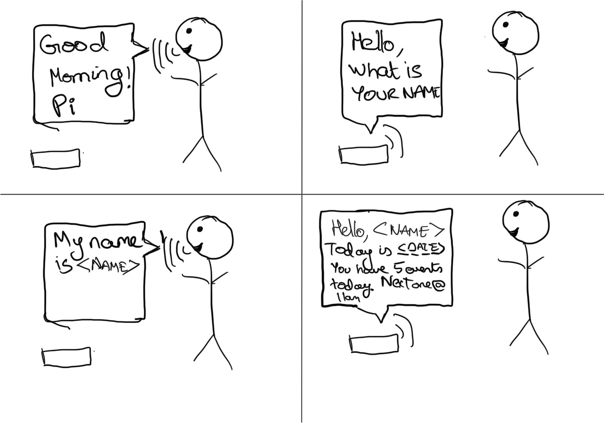
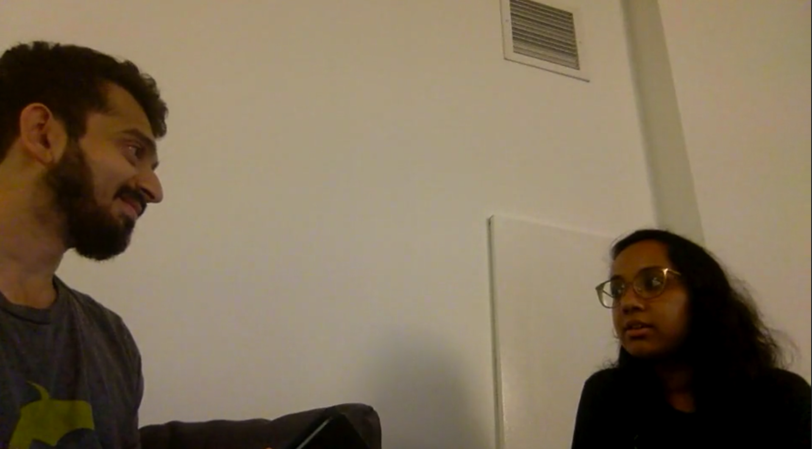
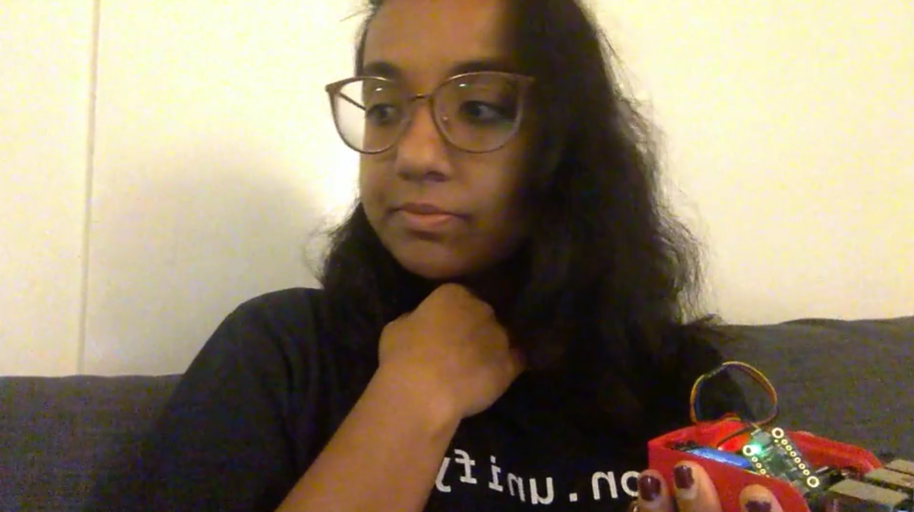
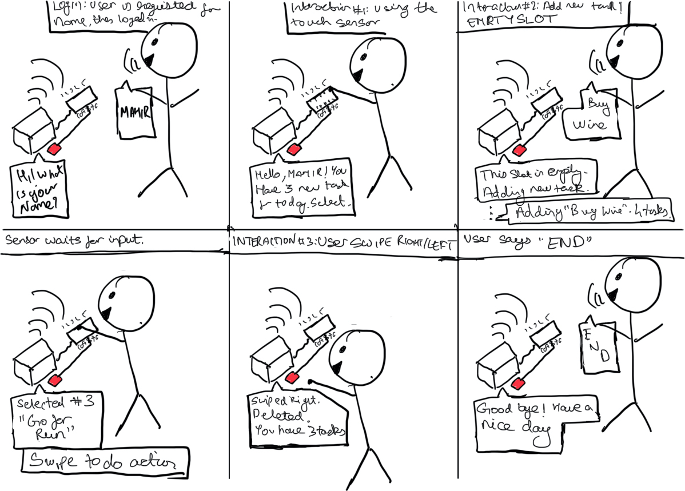
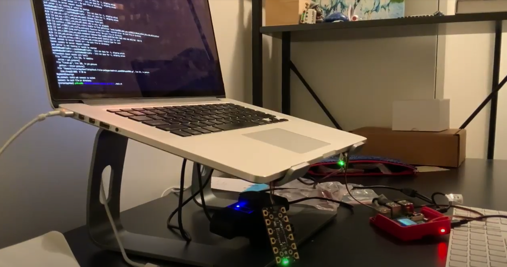

# Chatterboxes
[](https://www.youtube.com/embed/Q8FWzLMobx0?start=19)

In this lab, we want you to design interaction with a speech-enabled device--something that listens and talks to you. This device can do anything *but* control lights (since we already did that in Lab 1).  First, we want you first to storyboard what you imagine the conversational interaction to be like. Then, you will use wizarding techniques to elicit examples of what people might say, ask, or respond.  We then want you to use the examples collected from at least two other people to inform the redesign of the device.

We will focus on **audio** as the main modality for interaction to start; these general techniques can be extended to **video**, **haptics** or other interactive mechanisms in the second part of the Lab.

## Prep for Part 1: Get the Latest Content and Pick up Additional Parts 

### Pick up Additional Parts

As mentioned during the class, we ordered additional mini microphone for Lab 3. Also, a new part that has finally arrived is encoder! Please remember to pick them up from the TA.

### Get the Latest Content

As always, pull updates from the class Interactive-Lab-Hub to both your Pi and your own GitHub repo. As we discussed in the class, there are 2 ways you can do so:

**\[recommended\]**Option 1: On the Pi, `cd` to your `Interactive-Lab-Hub`, pull the updates from upstream (class lab-hub) and push the updates back to your own GitHub repo. You will need the *personal access token* for this.

```
pi@ixe00:~$ cd Interactive-Lab-Hub
pi@ixe00:~/Interactive-Lab-Hub $ git pull upstream Fall2021
pi@ixe00:~/Interactive-Lab-Hub $ git add .
pi@ixe00:~/Interactive-Lab-Hub $ git commit -m "get lab3 updates"
pi@ixe00:~/Interactive-Lab-Hub $ git push
```

Option 2: On your your own GitHub repo, [create pull request](https://github.com/FAR-Lab/Developing-and-Designing-Interactive-Devices/blob/2021Fall/readings/Submitting%20Labs.md) to get updates from the class Interactive-Lab-Hub. After you have latest updates online, go on your Pi, `cd` to your `Interactive-Lab-Hub` and use `git pull` to get updates from your own GitHub repo.

## Part 1.
### Text to Speech 

In this part of lab, we are going to start peeking into the world of audio on your Pi! 

We will be using a USB microphone, and the speaker on your webcamera. (Originally we intended to use the microphone on the web camera, but it does not seem to work on Linux.) In the home directory of your Pi, there is a folder called `text2speech` containing several shell scripts. `cd` to the folder and list out all the files by `ls`:

```
pi@ixe00:~/text2speech $ ls
Download        festival_demo.sh  GoogleTTS_demo.sh  pico2text_demo.sh
espeak_demo.sh  flite_demo.sh     lookdave.wav
```

You can run these shell files by typing `./filename`, for example, typing `./espeak_demo.sh` and see what happens. Take some time to look at each script and see how it works. You can see a script by typing `cat filename`. For instance:

```
pi@ixe00:~/text2speech $ cat festival_demo.sh 
#from: https://elinux.org/RPi_Text_to_Speech_(Speech_Synthesis)#Festival_Text_to_Speech

echo "Just what do you think you're doing, Dave?" | festival --tts
```

Now, you might wonder what exactly is a `.sh` file? Typically, a `.sh` file is a shell script which you can execute in a terminal. The example files we offer here are for you to figure out the ways to play with audio on your Pi!

You can also play audio files directly with `aplay filename`. Try typing `aplay lookdave.wav`.

\*\***Write your own shell file to use your favorite of these TTS engines to have your Pi greet you by name.**\*\*
(This shell file should be saved to your own repo for this lab.)
File is available here in:
```
$ Interactive-Lab-Hub/Lab 3/part1/speech.sh
```

Bonus: If this topic is very exciting to you, you can try out this new TTS system we recently learned about: https://github.com/rhasspy/larynx

### Speech to Text

Now examine the `speech2text` folder. We are using a speech recognition engine, [Vosk](https://alphacephei.com/vosk/), which is made by researchers at Carnegie Mellon University. Vosk is amazing because it is an offline speech recognition engine; that is, all the processing for the speech recognition is happening onboard the Raspberry Pi. 

In particular, look at `test_words.py` and make sure you understand how the vocab is defined. Then try `./vosk_demo_mic.sh`

One thing you might need to pay attention to is the audio input setting of Pi. Since you are plugging the USB cable of your webcam to your Pi at the same time to act as speaker, the default input might be set to the webcam microphone, which will not be working for recording.

\*\***Write your own shell file that verbally asks for a numerical based input (such as a phone number, zipcode, number of pets, etc) and records the answer the respondent provides.**\*\*
File is available here in the following location
```
$ Interactive-Lab-Hub/Lab 3/part1/get_user_data.sh
```
Please run
```
$ pip3 install gTTS
```

Bonus Activity:

If you are really excited about Speech to Text, you can try out [Mozilla DeepSpeech](https://github.com/mozilla/DeepSpeech) and [voice2json](http://voice2json.org/install.html)
There is an included [dspeech](./dspeech) demo  on the Pi. If you're interested in trying it out, we suggest you create a seperarate virutal environment for it . Create a new Python virtual environment by typing the following commands.

```
pi@ixe00:~ $ virtualenv dspeechexercise
pi@ixe00:~ $ source dspeechexercise/bin/activate
(dspeechexercise) pi@ixe00:~ $ 
```

### Serving Pages

In Lab 1, we served a webpage with flask. In this lab, you may find it useful to serve a webpage for the controller on a remote device. Here is a simple example of a webserver.

```
pi@ixe00:~/Interactive-Lab-Hub/Lab 3 $ python server.py
 * Serving Flask app "server" (lazy loading)
 * Environment: production
   WARNING: This is a development server. Do not use it in a production deployment.
   Use a production WSGI server instead.
 * Debug mode: on
 * Running on http://0.0.0.0:5000/ (Press CTRL+C to quit)
 * Restarting with stat
 * Debugger is active!
 * Debugger PIN: 162-573-883
```
From a remote browser on the same network, check to make sure your webserver is working by going to `http://<YourPiIPAddress>:5000`. You should be able to see "Hello World" on the webpage.

### Storyboard

Storyboard and/or use a Verplank diagram to design a speech-enabled device. (Stuck? Make a device that talks for dogs. If that is too stupid, find an application that is better than that.) 

\*\***Post your storyboard and diagram here.**\*\*

The chatter box below will allow the user to first set up the machine by asking a few basic questions. Once it has asked that information, it listens for the input from the user. It is able
to retrieve information about the user using the name and cann assist the user in making certain changes to their schedule. 



Write out what you imagine the dialogue to be. Use cards, post-its, or whatever method helps you develop alternatives or group responses. 

\*\***Please describe and document your process.**\*\*

I wrote down my expectations of the Pi first as ideas on a piece of paper, things such as "Asking the name", "providing data", "On boot greeting". This allowed
me to get an understanding of the possible interactions the Pi would have. I then used those word associations to help develop a series of possible dialogues.
For the sake of acting out and wizarding, I picked one which would be simpler in nature.


### Acting out the dialogue

Find a partner, and *without sharing the script with your partner* try out the dialogue you've designed, where you (as the device designer) act as the device you are designing.  Please record this interaction (for example, using Zoom's record feature).

\*\***Describe if the dialogue seemed different than what you imagined when it was acted out, and how.**\*\*

[](https://drive.google.com/file/d/1peJlqjs357qqxdlhrqT8lxhOKcNYQnvg/view?usp=sharing)

I started by being quiet and waiting for some sort of an input. When I recieved none, I hinted the user. I thought that might have been an issue when designing the storyboard
but had not accounted for it in the dialogues, that was the first difference.
The second difference is how I expected the name to be said by the partner instead of saying "ARNI" they said "My name is Arni" which is something I will have to account for.

### Wizarding with the Pi (optional)
In the [demo directory](./demo), you will find an example Wizard of Oz project. In that project, you can see how audio and sensor data is streamed from the Pi to a wizard controller that runs in the browser.  You may use this demo code as a template. By running the `app.py` script, you can see how audio and sensor data (Adafruit MPU-6050 6-DoF Accel and Gyro Sensor) is streamed from the Pi to a wizard controller that runs in the browser `http://<YouPiIPAddress>:5000`. You can control what the system says from the controller as well!

\*\***Describe if the dialogue seemed different than what you imagined, or when acted out, when it was wizarded, and how.**\*\*
[](https://drive.google.com/file/d/1AD9Pi3Rz3HSxk9IdU4xRJz3URdsrmf4u/view?usp=sharing)

Wizarding was a bit more complicated than either of the above activities. Specifically when acting out the dialogue my partner was able to play to my body language. Though they understood
what the dialogues were since they acted it out earlier, it was different as the Pi provides no clues as far as the next dialogue.

# Lab 3 Part 2

For Part 2, you will redesign the interaction with the speech-enabled device using the data collected, as well as feedback from part 1.

## Feedback

Yehao Zhang
> Clear illustration of a smart assistant. I found it funny to hear the 'device" saying "Hello 'my name is Arni", a nice catch of what might actually happen! was wondering if the device could perform more tasks, like being able to respond if the user asked what is the upcoming event.

Yuzhen Zhang
> The acting and the wizarding of the device are interesting, especially when the 'device" repeated "My name is Arni" instead of "Arni". am imagining this device to be able to record todo reminders for multiple people and tell them their corresponding tasks after knowing their names. So it could be a device for the whole family, or even a public device placed at the entrance of Bloomberg and storing and reminding the tasks for all students. Also, when talking with the device, there could be some feedback probably visually through the screen, to let the user know if the device is still listening or it has finished talking and is waiting for new input.

Gazi Inkiyad
> I liked how you caught "My name is Arni" part. Also you could probably have another feature that allows the user to add and delete events from their daily agendas.


## Prep for Part 2

1. What are concrete things that could use improvement in the design of your device? For example: wording, timing, anticipation of misunderstandings...
2. What are other modes of interaction _beyond speech_ that you might also use to clarify how to interact?
3. Make a new storyboard, diagram and/or script based on these reflections.

## Prototype your system

The system should:
* use the Raspberry Pi 
* use one or more sensors
* require participants to speak to it.

*Document how the system works*



Taking advice of the feedback from the peer reviews, I have added in an additional feature which the gesture and touch can be used to control the various tasks and adjust them.

The chatter box starts up and asks for the users name. It takes the value of the name at face-value, and uses that to 
help derive what tasks are available for the user. Once it has the name, it reacts in the following manner:
1. It tells the user how many tasks they have for the day and prompts the user for an option, hinting at them what they should do.
2. Based on the button which is pressed, the task is read out.
3. Once the task is read out, the device will prompt for gesture.
4. Swiping it left or right will delete it.
5. Up or down gesture adds a task can be added there. The chatterbox will ask for a task name and add it.

*Include videos or screencaptures of both the system and the controller.*

Please click to open video:
[](https://drive.google.com/file/d/1topAYLqEInPOH3syl1uypY76l0DZw79g/view?usp=sharing)

## Test the system
Try to get at least two people to interact with your system. (Ideally, you would inform them that there is a wizard _after_ the interaction, but we recognize that can be hard.)

> File Name: part2/main.sh

Answer the following:

### What worked well about the system and what didn't?
Worked Well:
1. The dialogue presented the user with good hints on what to do. The swiping to delete was intuitive.
2. The sensor was easy to understand from the users' perspective, they were able to recognize where to press or where to swipe

Did not work well:
1. The users were confused when it did not give feedback on the task.


### What worked well about the controller and what didn't?
Worked Well:
1. The voice recognition allowed for a good interaction with the user

Did Not Work well:
1. The sensor for the task picker proved to be a lot harder than expected, using unknown values. This would sometimes send the system in a loop 
2. If the voice recognizer took too long, the user would get restless and say more on the strings, causing a very long string being recognized by deepspeech


### What lessons can you take away from the WoZ interactions for designing a more autonomous version of the system?
The woz interactions were a good insight into what the user would expect as conversation, and allowed to set up a system
which keeps common responses in mind (for example how to respond to a question). The WoZ interactions also helped with the set up of
the microphone and the device to help connect the various elements of the device. 

### How could you use your system to create a dataset of interaction? What other sensing modalities would make sense to capture?
I can collect the common actions the users perform for example the order in which they press buttons based on the number of tasks and also how they swipe on the device.
Further it will be useful to collect data about how the users speak to the Pi, and difference in time between them speaking the voice recognition accepting it allowing for smoother interaction.
Finally, I would like to add a camera, that can further help the logging in process for the user and would allow special functions.

