# Ph-UI!!!

For lab this week, we focus on both on sensing, to bring in new modes of input into your devices, as well as prototyping the physical look and feel of the device. You will think about the physical form the device needs to perform the sensing as well as present the display or feedback about what was sensed. 

## Part 1 Lab Preparation

### Get the latest content:
As always, pull updates from the class Interactive-Lab-Hub to both your Pi and your own GitHub repo. As we discussed in the class, there are 2 ways you can do so:

**\[recommended\]**Option 1: On the Pi, `cd` to your `Interactive-Lab-Hub`, pull the updates from upstream (class lab-hub) and push the updates back to your own GitHub repo. You will need the personal access token for this.

```
pi@ixe00:~$ cd Interactive-Lab-Hub
pi@ixe00:~/Interactive-Lab-Hub $ git pull upstream Fall2021
pi@ixe00:~/Interactive-Lab-Hub $ git add .
pi@ixe00:~/Interactive-Lab-Hub $ git commit -m "get lab4 content"
pi@ixe00:~/Interactive-Lab-Hub $ git push
```

Option 2: On your your own GitHub repo, [create pull request](https://github.com/FAR-Lab/Developing-and-Designing-Interactive-Devices/blob/2021Fall/readings/Submitting%20Labs.md) to get updates from the class Interactive-Lab-Hub. After you have latest updates online, go on your Pi, `cd` to your `Interactive-Lab-Hub` and use `git pull` to get updates from your own GitHub repo.

### Start brasinstorming ideas by reading: 
* [What do prototypes prototype?](https://www.semanticscholar.org/paper/What-do-Prototypes-Prototype-Houde-Hill/30bc6125fab9d9b2d5854223aeea7900a218f149)
* [Paper prototyping](https://www.uxpin.com/studio/blog/paper-prototyping-the-practical-beginners-guide/) is used by UX designers to quickly develop interface ideas and run them by people before any programming occurs. 
* [Cardboard prototypes](https://www.youtube.com/watch?v=k_9Q-KDSb9o) help interactive product designers to work through additional issues, like how big something should be, how it could be carried, where it would sit. 
* [Tips to Cut, Fold, Mold and Papier-Mache Cardboard](https://makezine.com/2016/04/21/working-with-cardboard-tips-cut-fold-mold-papier-mache/) from Make Magazine.
* [Surprisingly complicated forms](https://www.pinterest.com/pin/50032245843343100/) can be built with paper, cardstock or cardboard.  The most advanced and challenging prototypes to prototype with paper are [cardboard mechanisms](https://www.pinterest.com/helgangchin/paper-mechanisms/) which move and change. 
* [Dyson Vacuum Cardboard Prototypes](http://media.dyson.com/downloads/JDF/JDF_Prim_poster05.pdf)
<p align="center"> </p>

### Gathering materials for this lab:

* Cardboard (start collecting those shipping boxes!)
* Found objects and materials--like bananas and twigs.
* Cutting board
* Cutting tools
* Markers

(We do offer shared cutting board, cutting tools, and markers on the class cart during the lab, so do not worry if you don't have them!)

## Deliverables \& Submission for Lab 4

The deliverables for this lab are, writings, sketches, photos, and videos that show what your prototype:
* "Looks like": shows how the device should look, feel, sit, weigh, etc.
* "Works like": shows what the device can do.
* "Acts like": shows how a person would interact with the device.

For submission, the readme.md page for this lab should be edited to include the work you have done:
* Upload any materials that explain what you did, into your lab 4 repository, and link them in your lab 4 readme.md.
* Link your Lab 4 readme.md in your main Interactive-Lab-Hub readme.md. 
* Group members can turn in one repository, but make sure your Hub readme.md links to the shared repository.
* Labs are due on Mondays, make sure to submit your Lab 4 readme.md to Canvas.


## Lab Overview

A) [Capacitive Sensing](#part-a)

B) [OLED screen](#part-b) 

C) [Paper Display](#part-c)

D) [Materiality](#part-d)

E) [Servo Control](#part-e)

F) [Record the interaction](#part-f)

## The Report (Part 1: A-D, Part 2: E-F)

### Part A
### Capacitive Sensing, a.k.a. Human-Twizzler Interaction 

We want to introduce you to the [capacitive sensor](https://learn.adafruit.com/adafruit-mpr121-gator) in your kit. It's one of the most flexible input devices we are able to provide. At boot, it measures the capacitance on each of the 12 contacts. Whenever that capacitance changes, it considers it a user touch. You can attach any conductive material. In your kit, you have copper tape that will work well, but don't limit yourself! In the example below, we use Twizzlers--you should pick your own objects.


<p float="left">


</p>

Plug in the capacitive sensor board with the QWIIC connector. Connect your Twizzlers with either the copper tape or the alligator clips (the clips work better). In this lab, we will continue to use the `circuitpython` virtual environment we created before. Activate `circuitpython` and `cd` to your Lab 4 folder to install the requirements by:

```
(circuitpython) pi@ixe00:~/Interactive-Lab-Hub/Lab 4 $ pip3 install -r requirements.txt
```


These Twizzlers are connected to pads 6 and 10. When you run the code and touch a Twizzler, the terminal will print out the following

```
(circuitpython) pi@ixe00:~/Interactive-Lab-Hub/Lab 4 $ python cap_test.py 
Twizzler 10 touched!
Twizzler 6 touched!
```

### Part B
### More sensors

#### Light/Proximity/Gesture sensor (APDS-9960)

We here want you to get to know this awesome sensor [Adafruit APDS-9960](https://www.adafruit.com/product/3595). It is capable of sensing proximity, light (also RGB), and gesture! 


Connect it to your pi with Qwiic connector and try running the three example scripts individually to see what the sensor is capable of doing!

```
(circuitpython) pi@ixe00:~/Interactive-Lab-Hub/Lab 4 $ python proximity_test.py
...
(circuitpython) pi@ixe00:~/Interactive-Lab-Hub/Lab 4 $ python gesture_test.py
...
(circuitpython) pi@ixe00:~/Interactive-Lab-Hub/Lab 4 $ python color_test.py
...
```

You can go the the [Adafruit GitHub Page](https://github.com/adafruit/Adafruit_CircuitPython_APDS9960) to see more examples for this sensor!

#### Rotary Encoder

A rotary encoder is an electro-mechanical device that converts the angular position to analog or digital output signals. The [Adafruit rotary encoder](https://www.adafruit.com/product/4991#technical-details) we ordered for you came with separated breakout board and encoder itself, that is, they will need to be soldered if you have not yet done so! We will be bringing the soldering station to the lab class for you to use, also, you can go to the MakerLAB to do the soldering off-class. Here is some [guidance on soldering](https://learn.adafruit.com/adafruit-guide-excellent-soldering/preparation) from Adafruit. When you first solder, get someone who has done it before (ideally in the MakerLAB environment). It is a good idea to review this material beforehand so you know what to look at.

<p float="left">


</p>

Connect it to your pi with Qwiic connector and try running the example script, it comes with an additional button which might be useful for your design!

```
(circuitpython) pi@ixe00:~/Interactive-Lab-Hub/Lab 4 $ python encoder_test.py
```

You can go to the [Adafruit Learn Page](https://learn.adafruit.com/adafruit-i2c-qt-rotary-encoder/python-circuitpython) to learn more about the sensor! The sensor actually comes with an LED (neo pixel): Can you try lighting it up? 

#### Joystick

A [joystick](https://www.sparkfun.com/products/15168) can be used to sense and report the input of the stick for it pivoting angle or direction. It also comes with a button input!

<p float="left">

</p>

Connect it to your pi with Qwiic connector and try running the example script to see what it can do!

```
(circuitpython) pi@ixe00:~/Interactive-Lab-Hub/Lab 4 $ python joystick_test.py
```

You can go to the [SparkFun GitHub Page](https://github.com/sparkfun/Qwiic_Joystick_Py) to learn more about the sensor!

#### (Optional) Distance Sensor

Note: We did not distribute this sensor to you, so if you are interested in playing with it, please come pick it up from the TA!

Earlier we have asked you to play with the proximity sensor, which is able to sense object within a short distance. Here, we offer [Qwiic Multi Distance Sensor](https://www.sparkfun.com/products/17072), which has a field of view of about 25° and is able to detect objects up to 3 meters away! 

<p float="left">

</p>

Connect it to your pi with Qwiic connector and try running the example script to see how it works!

```
(circuitpython) pi@ixe00:~/Interactive-Lab-Hub/Lab 4 $ python distance_test.py
```

You can go to the [SparkFun GitHub Page](https://github.com/sparkfun/Qwiic_VL53L1X_Py) to learn more about the sensor and see other examples!

### Part C
### Physical considerations for sensing

Usually, sensors need to positioned in specific locations or orientations to make them useful for their application. Now that you've tried a bunch of the sensors, pick one that you would like to use, and an application where you use the output of that sensor for an interaction. For example, you can use a distance sensor to measure someone's height if you position it overhead and get them to stand under it.

**Draw 5 sketches of different ways you might use your sensor, and how the larger device needs to be shaped in order to make the sensor useful**

I chose to use the distance sensor because it can provide a wide range of motion and view and can also be updated, so it can measure specifically what is required. 
Please note: These are all x-ray sketches i.e. the show the placement of the internals in the device

### Security Motion Sensor
This device places the distance sensor at a 25-degree angle, and connects to the pi, with a small length to allow for the sensor to cover more room, 
placing the sensor at 25 degrees will allow for a larger field of view. Combined with the 25 degrees that the distance sensor is able to cover it will 
allow for sensing more movement.

### Overhead Door opener
The distance sensor is at a closer, 45-degree angle, which focuses more on the people walking through the door itself, and won't trigger when people walk 
by the door generally. The sensor could also be at a closer 60 degree measure which will be more specific to the door. 

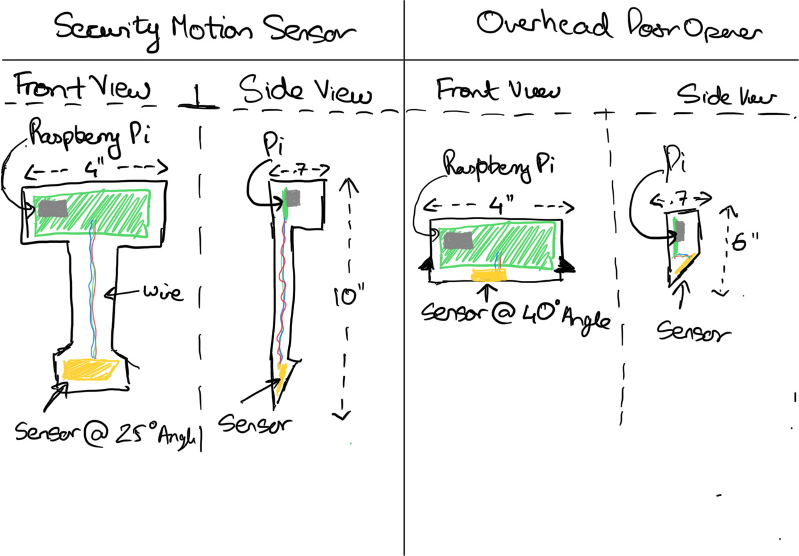

### Carpenters assistant
The carpenters assistant will provide a method for folks who want an accurate distance measure while conducting a project. The distance sensor will be
placed on one side and a screen will allow the user to see what the distance is from the wall its facing. Multiple sensors can enhance this to show 
distances relative to multiple walls.

### Car Parking assistant 
The car parking assistant will show a user when they are too close to a wall so that they do not hit the car against the wall. The sensor will be placed
at the bottom, and have a wire which will line the height of the wall presenting a light at the height of the car which turns red when the car is
too close. 

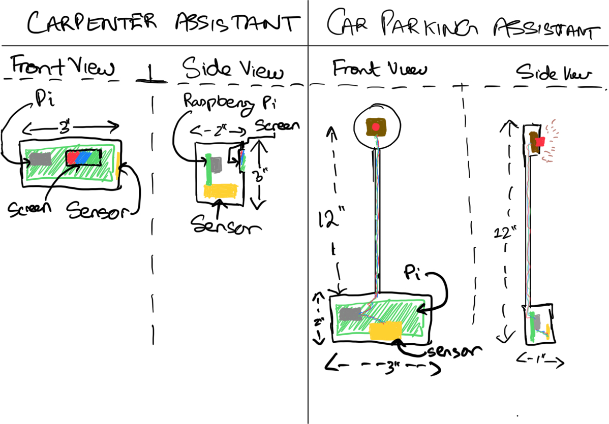

### Walking assistance for the blind
The walking assistance for the blind features a sensor perched on top of eyeglasses which will allow for someone who is visually impaired to "navigate" the space
with the help of a distance measure based on where they look. 


 

**What are some things these sketches raise as questions? What do you need to physically prototype to understand how to answer those questions?**

1. How do we display the sensor so that it is hidden, but it does not affect the distance measurement. This would need to be prototyped using various materials like glass and plastic.
2. For the security motion sensor, understanding how sensitive it is will depend on the angle, and ensuring its placed correct is important 
3. For the Carpenters Assistant, how do we tell the user which side the sensor is on, while masking it? Would need to prototype the device to place the sensor, on the sides while leaving space for the screen.
4. The walking assistance for the blind will require a manner show haptic feedback to the user, and allow the user to input their destination.

**Pick one of these designs to prototype.**

I decided to choose the Car Parking assistant.

### Part D
### Physical considerations for displaying information and housing parts


Here is an Pi with a paper faceplate on it to turn it into a display interface:


This is fine, but the mounting of the display constrains the display location and orientation a lot. Also, it really only works for applications where people can come and stand over the Pi, or where you can mount the Pi to the wall.

Here is another prototype for a paper display:


Your kit includes these [SparkFun Qwiic OLED screens](https://www.sparkfun.com/products/17153). These use less power than the MiniTFTs you have mounted on the GPIO pins of the Pi, but, more importantly, they can be more flexibily be mounted elsewhere on your physical interface. The way you program this display is almost identical to the way you program a  Pi display. Take a look at `oled_test.py` and some more of the [Adafruit examples](https://github.com/adafruit/Adafruit_CircuitPython_SSD1306/tree/master/examples).

<p float="left">


</p>


It holds a Pi and usb power supply, and provides a front stage on which to put writing, graphics, LEDs, buttons or displays.

This design can be made by scoring a long strip of corrugated cardboard of width X, with the following measurements:

| Y height of box <br> <sub><sup>- thickness of cardboard</sup></sub> | Z  depth of box <br><sub><sup>- thickness of cardboard</sup></sub> | Y height of box  | Z  depth of box | H height of faceplate <br><sub><sup>* * * * * (don't make this too short) * * * * *</sup></sub>|
| --- | --- | --- | --- | --- | 

Fold the first flap of the strip so that it sits flush against the back of the face plate, and tape, velcro or hot glue it in place. This will make a H x X interface, with a box of Z x X footprint (which you can adapt to the things you want to put in the box) and a height Y in the back. 

Here is an example:


Think about how you want to present the information about what your sensor is sensing! Design a paper display for your project that communicates the state of the Pi and a sensor. Ideally you should design it so that you can slide the Pi out to work on the circuit or programming, and then slide it back in and reattach a few wires to be back in operation.
 
**Sketch 5 designs for how you would physically position your display and any buttons or knobs needed to interact with it.**

The device features a screen which shows the distance and a rotary encoder to help set the value at which a car should be told to stop before the hit the wall.

- The encoder will be turned, and the button will help "set" the value when the user believes its a good point
- The screen will show the value to set it and the current distance
- The light on the top part of the device will be used to show when the distance or car is too close.
- Note: As in the Part 1.a, the brown background with a red dot is a light. The button has been labeled separately.

1. On the light
> Here the light has a screen attached to it, to visually represent the distance from the sensor the car is and can show when to stop
2. At the sensor
> The display is at the sensor along with the encoder and the button, its only visible during setup

3. External to the device
> Similar to the other displays, however here the display is kept separate from the main sensor

4. As the main display
> The light is completely removed, and replaced by the screen. The rotary encoder and button are on the main device


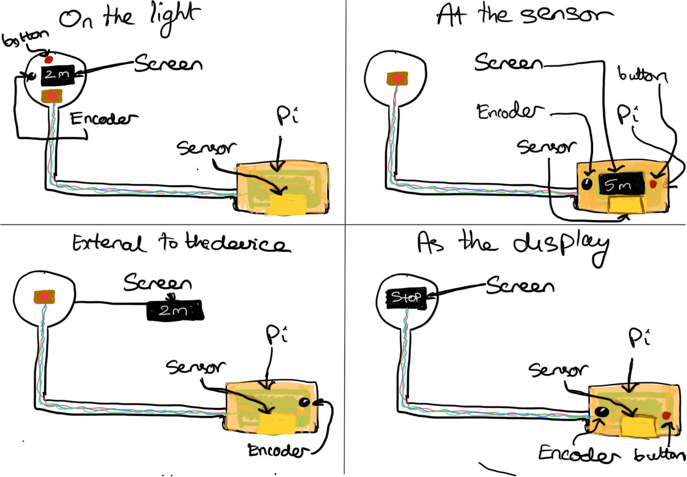

5. Below the rotary and button

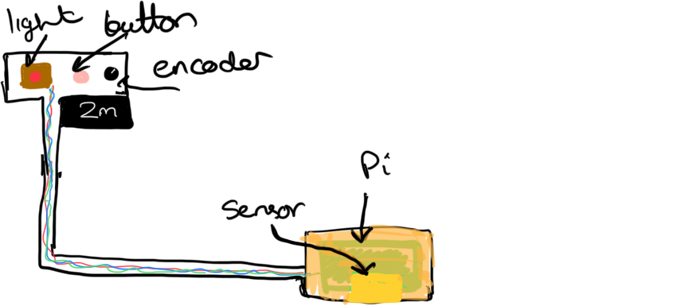


**What are some things these sketches raise as questions? What do you need to physically prototype to understand how to answer those questions?**

1. How would the display and the encoder interact? We would need to place the encoder and display in a manner that allows the user to know they are coupled
2. Would need to see how if the light and the screen would cause a collision as far as how bright they are
3. I would also like to prototype the wire extenstion between the screen and the pi to make sure they are easy to manage.
4. How would the screen, encoder etc stay in place at the vertical position

**Pick one of these display designs to integrate into your prototype.**

I am choosing the option 1: "On the light"

**Explain the rationale for the design.** (e.g. Does it need to be a certain size or form or need to be able to be seen from a certain distance?)

The design is a little busy, however it allows a good dissociation between the screen, button encoder and light which are all connected, and separates it from the distance sensor,
which is a separate part of the device. This will allow the user to be able to understand how to interact with the device better.
Additionally, keeping the button in a location where the user can read will provide an additional measure to the user and allow them to 
read the distance from afar. The light will be a good visual representation to the user since its visible at greater distances than the screen. 
I chose to make one modification to it, I added the button to confirm the distance to the
right of the display to make it easier to understand, which is not represented above.

_**Build a cardboard prototype of your design.**_

**Document your rough prototype.**

#### Display and Encoder
I started with a round cardboard and cut holes for the button, light, encoder and the OLED.
I then used pieces of cardboard and tape to attach the sensors to the base plate.
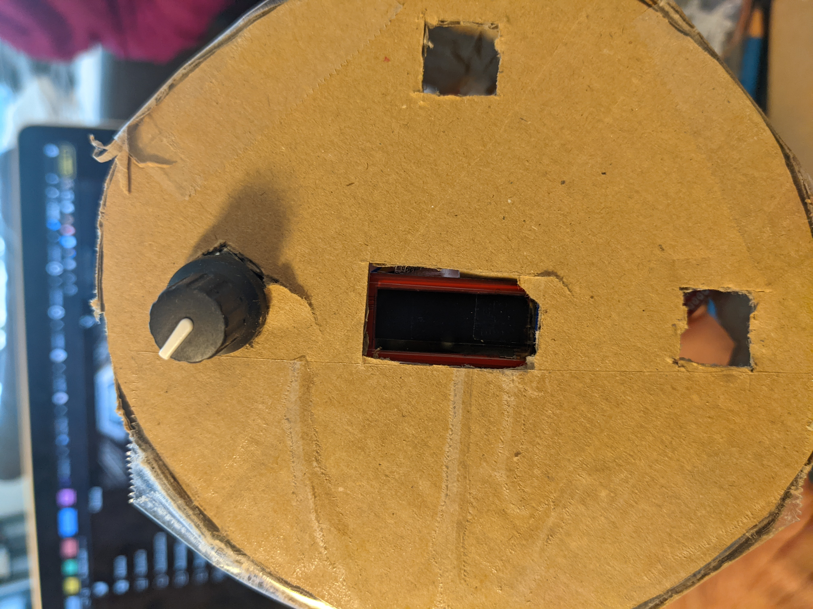

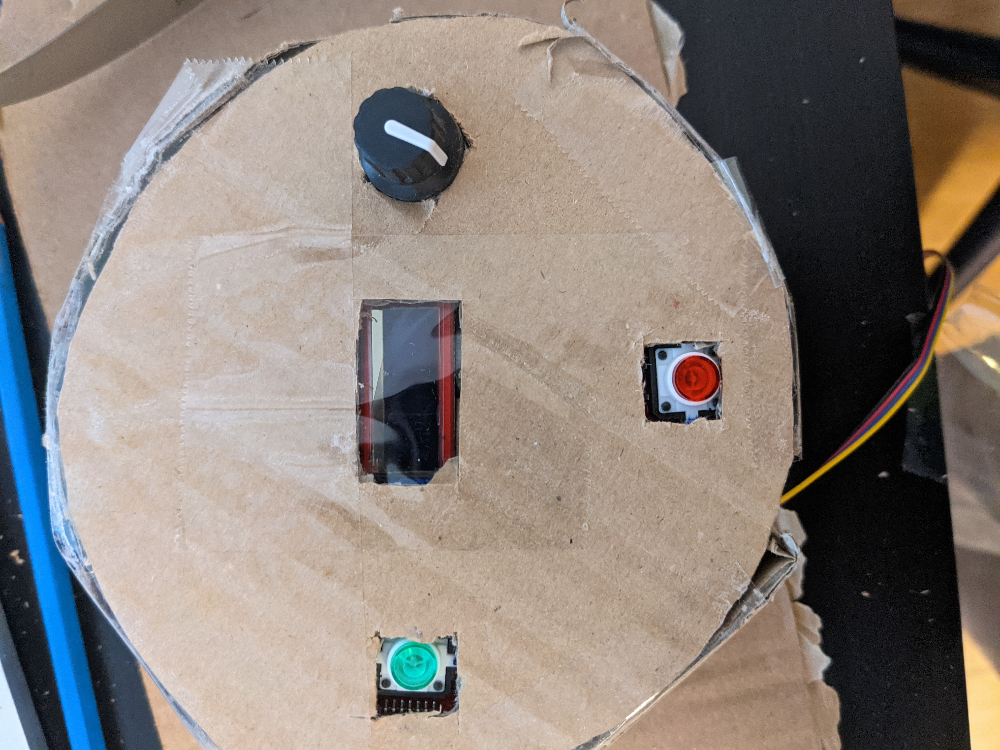
[](https://drive.google.com/file/d/1GRWkgSN0hoNAJsBb61bcGF6NMnaBYDFq/view?usp=sharing)

#### Backplate and placements
Following that I attached a backplate with the cardboard and added a little handle to be able to 
open the back and access it.
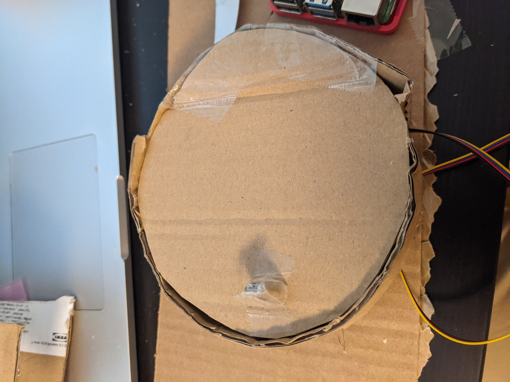
[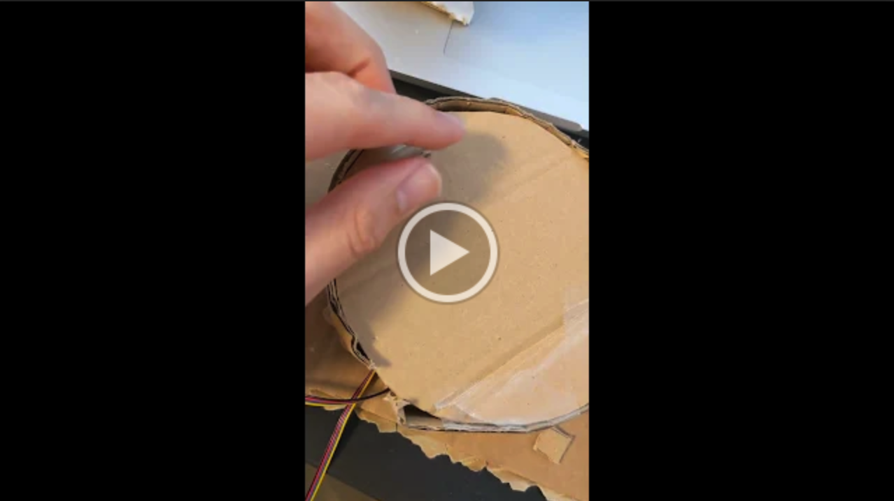](https://drive.google.com/file/d/1237sgJMCkc0zWpNPhDB_loeDUodzPtPp/view)

#### Sensor and Pi Hub
Next I worked on the base with the sensor and the Pi itself, here I added the distance sensor, and the pi. I made a whole for the incoming wire, and kept an opening
at the bottom to allow the pi to slide in and how for easy access.
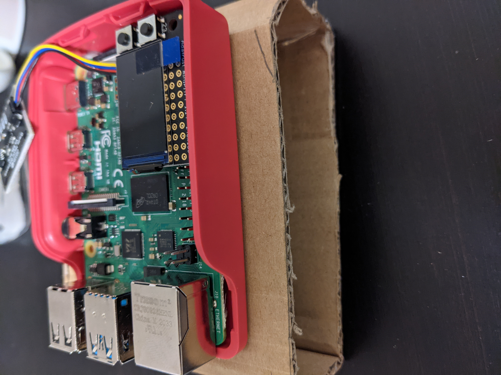
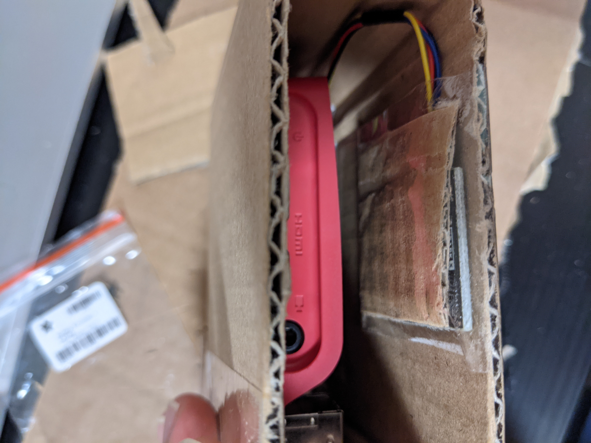
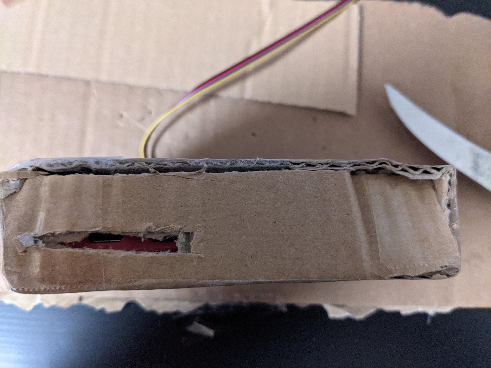
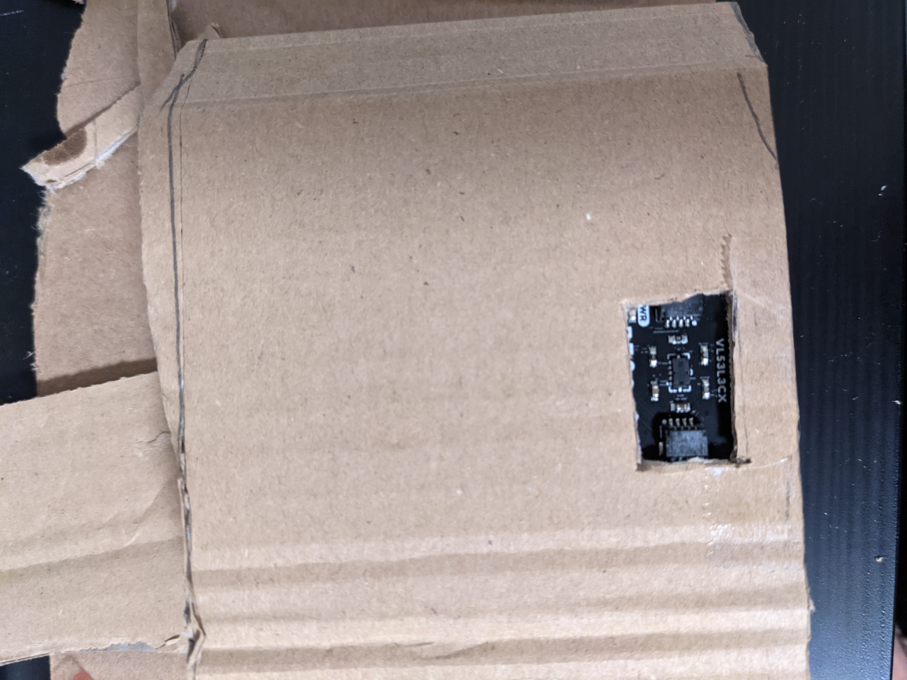
[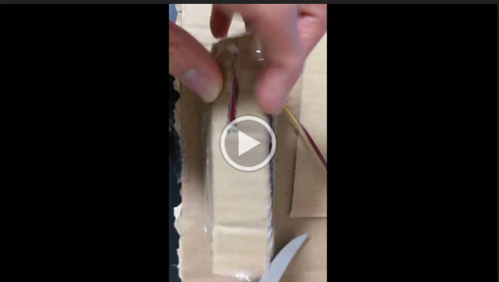](https://drive.google.com/file/d/1Z_0p2y50O4cIl_66lQkl6FzP5T1ZyUp5/view?usp=sharing)
[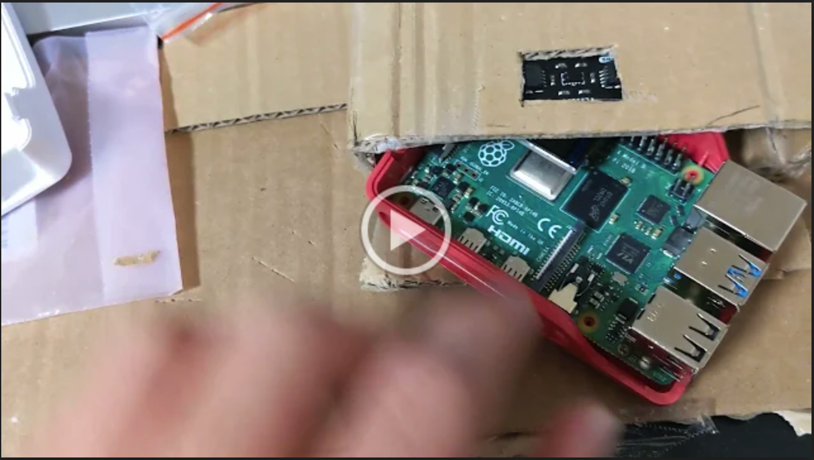](https://drive.google.com/file/d/1UsWbbx0Rua4r4QMWIoxI6wHTZqf_GtP6/view?usp=sharing)


### Final Product
Below is the final product
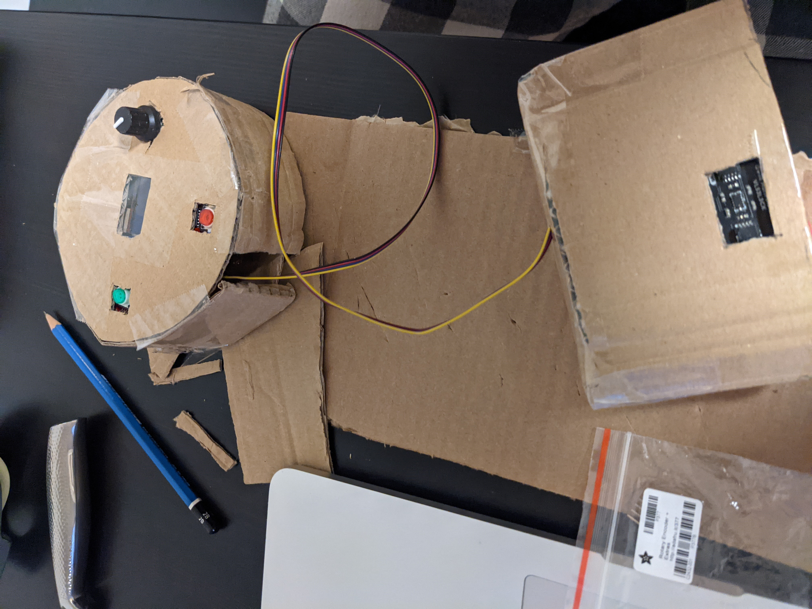
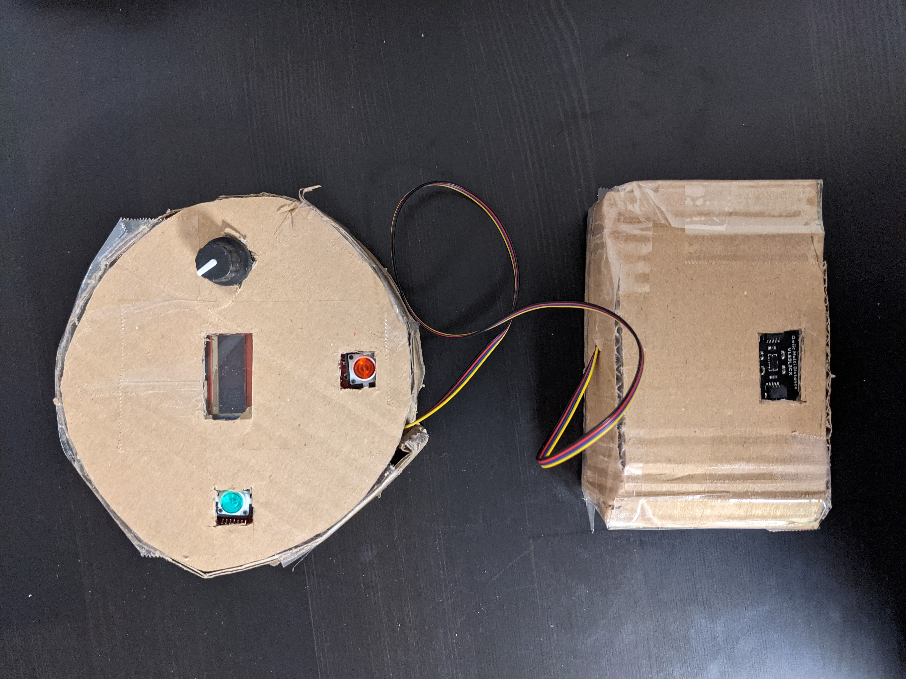
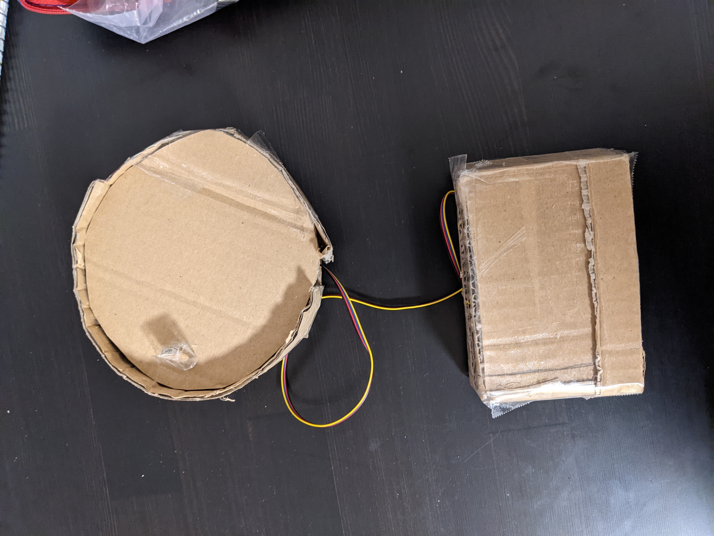


## LAB PART 2

### Part 2

Following exploration and reflection from Part 1, complete the "looks like," "works like" and "acts like" prototypes for your design, reiterated below.

### Part E (Optional)
### Servo Control with Joystick

In the class kit, you should be able to find the [Qwiic Servo Controller](https://www.sparkfun.com/products/16773) and [Micro Servo Motor SG51](https://www.adafruit.com/product/2201). The Qwiic Servo Controller will need external power supply to drive, which we will be distributing the battery packs in the class. Connect the servo controller to the miniPiTFT through qwiic connector and connect the external battery to the 2-Pin JST port (ower port) on the servo controller. Connect your servo to channel 2 on the controller, make sure the brown is connected to GND and orange is connected to PWM.


In this exercise, we will be using the nice [ServoKit library](https://learn.adafruit.com/16-channel-pwm-servo-driver/python-circuitpython) developed by Adafruit! We will continue to use the `circuitpython` virtual environment we created. Activate the virtual environment and make sure to install the latest required libraries by running:

```
(circuitpython) pi@ixe00:~/Interactive-Lab-Hub/Lab 4 $ pip3 install -r requirements.txt
```

A servo motor is a rotary actuator or linear actuator that allows for precise control of angular or linear position. The position of a servo motor is set by the width of an electrical pulse, that is, we can use PWM (pulse-width modulation) to set and control the servo motor position. You can read [this](https://learn.adafruit.com/adafruit-arduino-lesson-14-servo-motors/servo-motors) to learn a bit more about how exactly a servo motor works.

Now that you have a basic idea of what a servo motor is, look into the script `qwiic_servo_example.py` we provide. In line 14, you should see that we have set up the min_pulse and max_pulse corresponding to the servo turning 0 - 180 degree. Try running the servo example code now and see what happens:

```
(circuitpython) pi@ixe00:~/Interactive-Lab-Hub/Lab 4 $ python servo_test.py
```

It is also possible to control the servo using the sensors mentioned in as in part A and part B, and/or from some of the buttons or parts included in your kit, the simplest way might be to chain Qwiic buttons to the other end of the Qwiic OLED. Like this:

<p align="center"> </p>

You can then call whichever control you like rather than setting a fixed value for the servo. For more information on controlling Qwiic devices, Sparkfun has several python examples, such as [this](https://learn.sparkfun.com/tutorials/qwiic-joystick-hookup-guide/all#python-examples).

We encourage you to try using these controls, **while** paying particular attention to how the interaction changes depending on the position of the controls. For example, if you have your servo rotating a screen (or a piece of cardboard) from one position to another, what changes about the interaction if the control is on the same side of the screen, or the opposite side of the screen? Trying and retrying different configurations generally helps reveal what a design choice changes about the interaction -- _make sure to document what you tried_!

### Feedback

>The ideas all look great and the car parking assistant is useful. It is really interesting to see the physical build of the device and how the back side of it is also designed with a opening mechanism. As a user I am a bit confused about what the rotary encoder and the buttons control just by looking at the device. Probably some texts or visual feedback from the screen could help explain that. Also, maybe sound could be used to notify the user since when driving the driver don't always look at the screen. The speaker could be used!

> Cool idea to use the distance sensor, love how you prototyped with a cardboard to place all the buttons and the display. It was not quite clear to me where the device is going to be placed tho, would it be better to be on the wall or the vehicle? Also, it could expand to adding a sound alarm when the vehicle gets too close to the wall.


### Part F
### Record

Document all the prototypes and iterations you have designed and worked on! Again, deliverables for this lab are writings, sketches, photos, and videos that show what your prototype:
* "Looks like": shows how the device should look, feel, sit, weigh, etc.
* "Works like": shows what the device can do
* "Acts like": shows how a person would interact with the device

> Code in code/parking.py

After discussing with a few friends as well as using the reviews from above, a couple of similar themes emerged in the comments. Specifically the following: 
- Try and add a sound to the device as well, this will help the user understand more than the light. However, while conversing more about the applications of the sound, an interesting point that was discussed was that the sound may have to be very loud to be practical.
- Another point was how the device would be placed, specifically the discussion on if its more applicable for the car or on the wall. We discussed that the sensor should be placed on the wall, as even though it would be usable in certain situation, it can be customized to the garage.
- Last piece of feedback was understanding what the encoder does, for that I decided to make a few changes to the text on the device to make it more understandable.

Using these pieces of feedback there are a few changes that I decided to make to help improve the usability of the system. I played around with how these 
changes can be made while allowing for a compact designs. Here are the changes which I decided to incorporate into the design to make it more effective. 
First, I added a speaker to the device, which would be attached at the bottom of the device, which is invisible to the user; providing a more audio representation with the visual representation. The next
change I incorporated is the addition of the text on the device to help with the wizarding of the device. Finally, in the usage of the device, I decided that we can
use both the green and red lights, which will help inform the user when they are at a good distance. As the device itself has not changed since the initial sketch 

> Please note: As I do not have a car, I am trialing the system using a sofa to simulate the car. 

Sketch
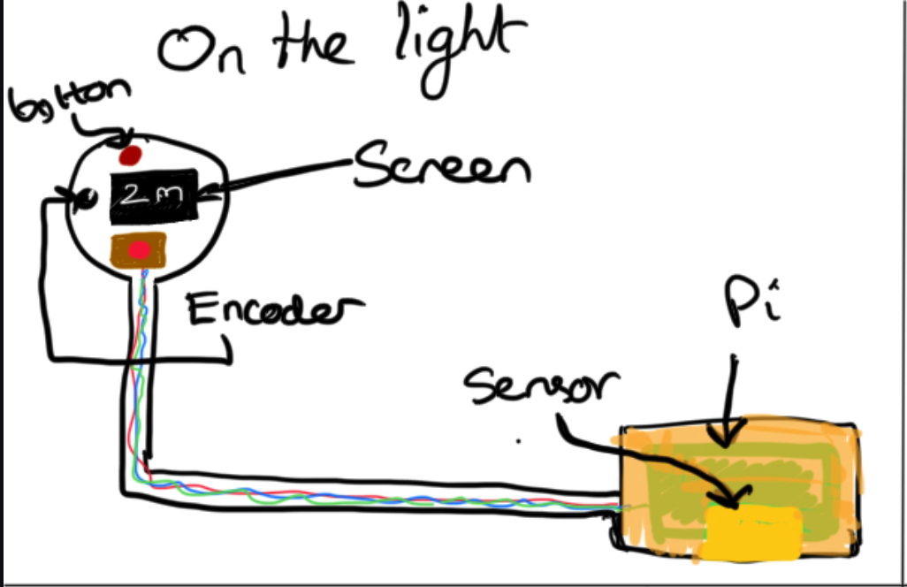

The device will be attached to the wall, with the indicator placed at a height where a driver can see the indicator and have easy access to it.

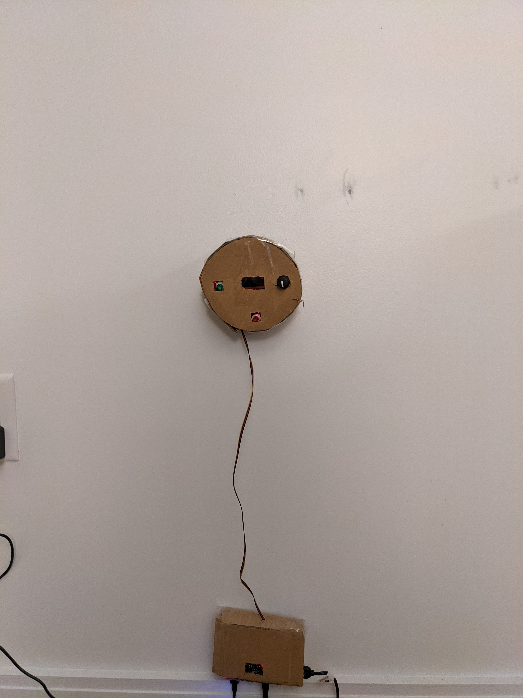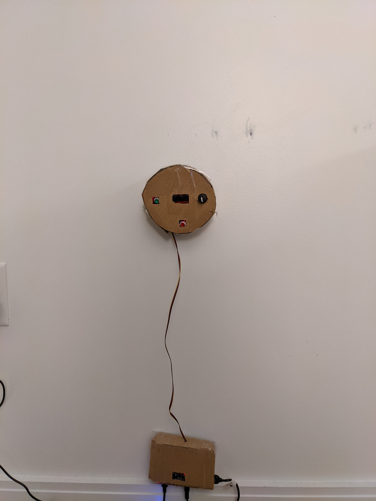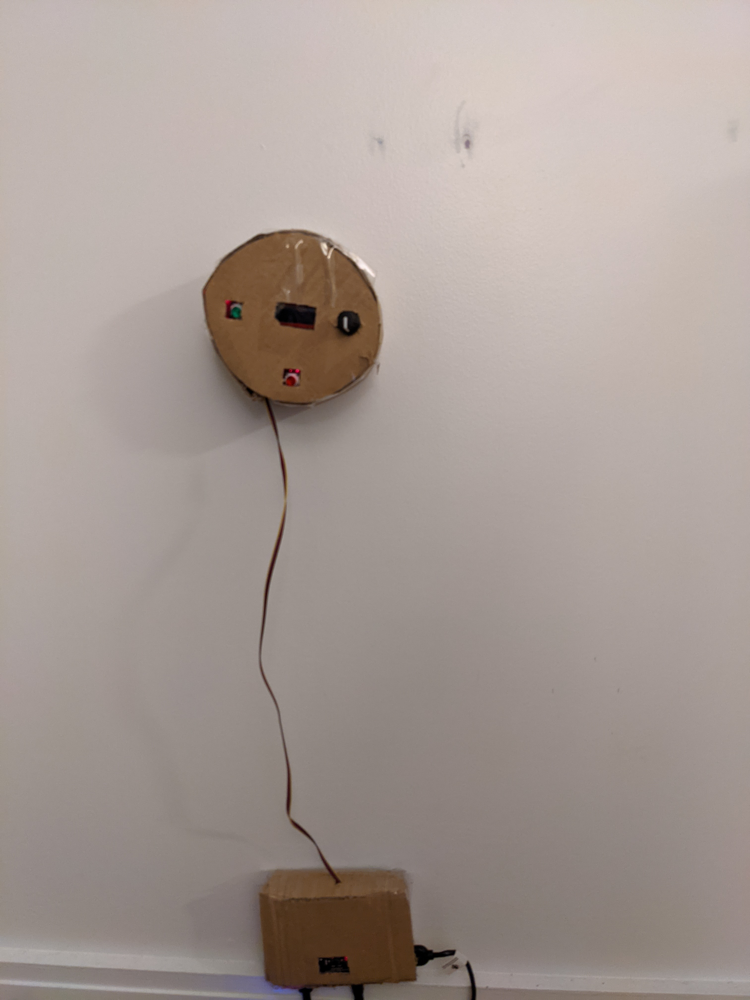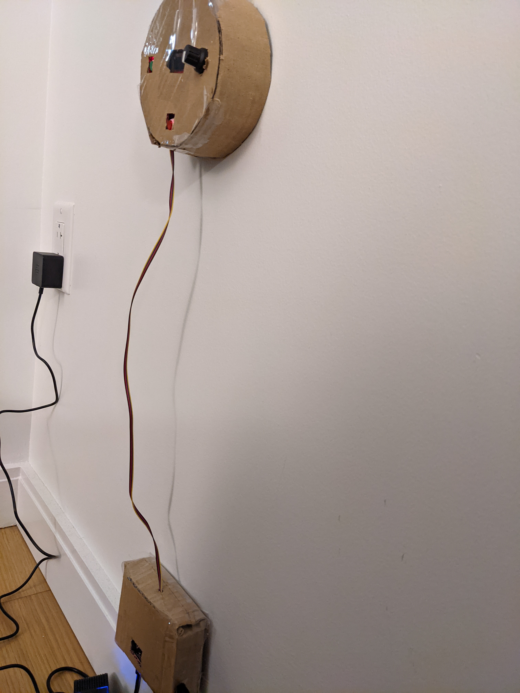


The below video shows how the device is set up and brief interaction without anyone else involved. 

[](https://drive.google.com/file/d/15ZbZpX2sO0fpQTAbo4n0cCqCKBPpq8wo/view?usp=sharing)


I tested out the device to show how it would act and gather some feedback, below is the video, along with a few questions

[](https://drive.google.com/file/d/1bKAo4i23rYff9u1H4mKduVR1vvCRSpzF/view?usp=sharing)
