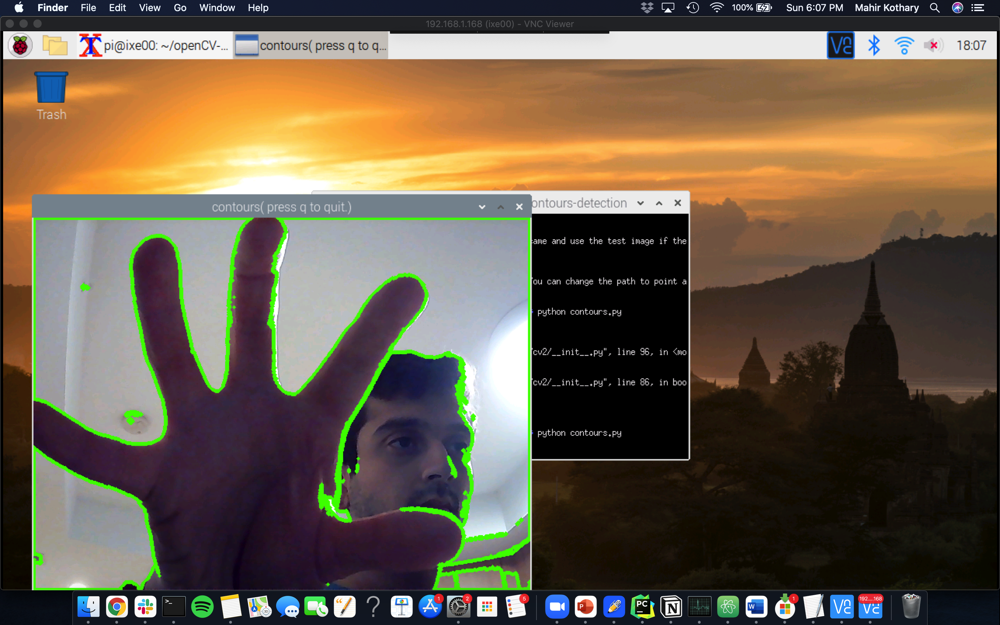
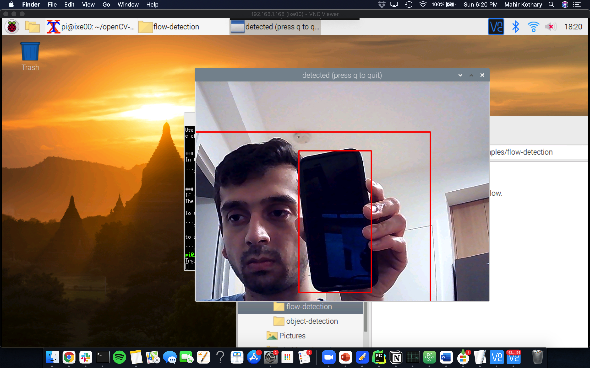
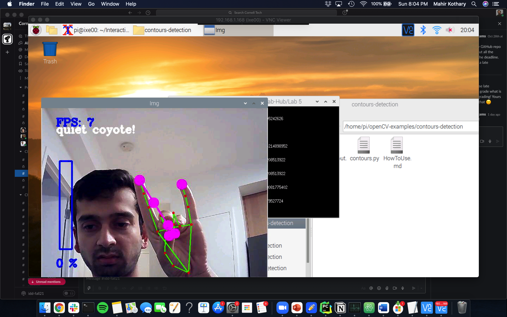
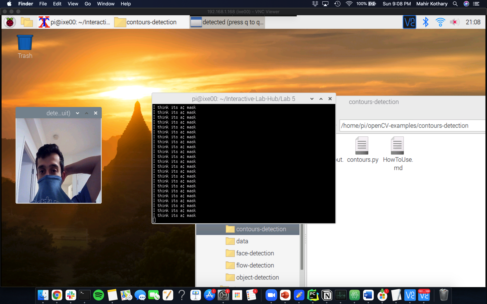
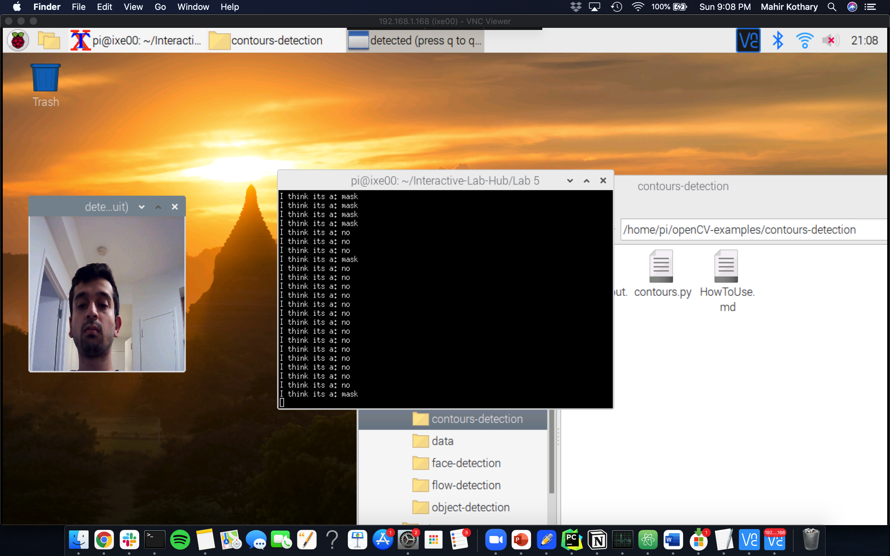
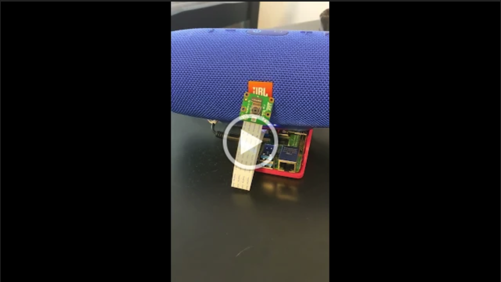

# Observant Systems


For lab this week, we focus on creating interactive systems that can detect and respond to events or stimuli in the environment of the Pi, like the Boat Detector we mentioned in lecture. 
Your **observant device** could, for example, count items, find objects, recognize an event or continuously monitor a room.

This lab will help you think through the design of observant systems, particularly corner cases that the algorithms needs to be aware of.

## Prep

1.  Pull the new Github Repo.
2.  Install VNC on your laptop if you have not yet done so. This lab will actually require you to run script on your Pi through VNC so that you can see the video stream. Please refer to the [prep for Lab 2](https://github.com/FAR-Lab/Interactive-Lab-Hub/blob/Fall2021/Lab%202/prep.md), we offered the instruction at the bottom.
3.  Read about [OpenCV](https://opencv.org/about/), [MediaPipe](https://mediapipe.dev/), and [TeachableMachines](https://teachablemachine.withgoogle.com/).
4.  Read Belloti, et al.'s [Making Sense of Sensing Systems: Five Questions for Designers and Researchers](https://www.cc.gatech.edu/~keith/pubs/chi2002-sensing.pdf).

### For the lab, you will need:

1. Raspberry Pi
1. Webcam 
1. Microphone (if you want to have speech or sound input for your design)

### Deliverables for this lab are:
1. Show pictures, videos of the "sense-making" algorithms you tried.
1. Show a video of how you embed one of these algorithms into your observant system.
1. Test, characterize your interactive device. Show faults in the detection and how the system handled it.

## Overview
Building upon the paper-airplane metaphor (we're understanding the material of machine learning for design), here are the four sections of the lab activity:

A) [Play](#part-a)

B) [Fold](#part-b)

C) [Flight test](#part-c)

D) [Reflect](#part-d)

---

### Part A
### Play with different sense-making algorithms.

#### OpenCV
A more traditional method to extract information out of images is provided with OpenCV. The RPI image provided to you comes with an optimized installation that can be accessed through python. We included 4 standard OpenCV examples: contour(blob) detection, face detection with the ``Haarcascade``, flow detection (a type of keypoint tracking), and standard object detection with the [Yolo](https://pjreddie.com/darknet/yolo/) darknet.

Most examples can be run with a screen (e.g. VNC or ssh -X or with an HDMI monitor), or with just the terminal. The examples are separated out into different folders. Each folder contains a ```HowToUse.md``` file, which explains how to run the python example. 

Following is a nicer way you can run and see the flow of the `openCV-examples` we have included in your Pi. Instead of `ls`, the command we will be using here is `tree`. [Tree](http://mama.indstate.edu/users/ice/tree/) is a recursive directory colored listing command that produces a depth indented listing of files. Install `tree` first and `cd` to the `openCV-examples` folder and run the command:

```shell
pi@ixe00:~ $ sudo apt install tree
...
pi@ixe00:~ $ cd openCV-examples
pi@ixe00:~/openCV-examples $ tree -l
.
├── contours-detection
│   ├── contours.py
│   └── HowToUse.md
├── data
│   ├── slow_traffic_small.mp4
│   └── test.jpg
├── face-detection
│   ├── face-detection.py
│   ├── faces_detected.jpg
│   ├── haarcascade_eye_tree_eyeglasses.xml
│   ├── haarcascade_eye.xml
│   ├── haarcascade_frontalface_alt.xml
│   ├── haarcascade_frontalface_default.xml
│   └── HowToUse.md
├── flow-detection
│   ├── flow.png
│   ├── HowToUse.md
│   └── optical_flow.py
└── object-detection
    ├── detected_out.jpg
    ├── detect.py
    ├── frozen_inference_graph.pb
    ├── HowToUse.md
    └── ssd_mobilenet_v2_coco_2018_03_29.pbtxt
```

The flow detection might seem random, but consider [this recent research](https://cseweb.ucsd.edu/~lriek/papers/taylor-icra-2021.pdf) that uses optical flow to determine busy-ness in hospital settings to facilitate robot navigation. Note the velocity parameter on page 3 and the mentions of optical flow.

Now, connect your webcam to your Pi and use **VNC to access to your Pi** and open the terminal. Use the following command lines to try each of the examples we provided:
(***it will not work if you use ssh from your laptop***)

```
pi@ixe00:~$ cd ~/openCV-examples/contours-detection
pi@ixe00:~/openCV-examples/contours-detection $ python contours.py
...
pi@ixe00:~$ cd ~/openCV-examples/face-detection
pi@ixe00:~/openCV-examples/face-detection $ python face-detection.py
...
pi@ixe00:~$ cd ~/openCV-examples/flow-detection
pi@ixe00:~/openCV-examples/flow-detection $ python optical_flow.py 0 window
...
pi@ixe00:~$ cd ~/openCV-examples/object-detection
pi@ixe00:~/openCV-examples/object-detection $ python detect.py
```

**\*\*\*Try each of the following four examples in the `openCV-examples`, include screenshots of your use and write about one design for each example that might work based on the individual benefits to each algorithm.\*\*\***

##### Contours


This can be used for path planning in a 3D space, having the camera detection will help provide an outline of all potential obstacles in the way

##### Face


Face detection can be used to validate the identity of someone, as a front facing camera, which can help ensure it highlights a person and not random objects.


##### Optical


This could be used for traffic detection at lights to monitor cars and see if any of them cross the red light.


##### Object



#### MediaPipe

A more recent open source and efficient method of extracting information from video streams comes out of Google's [MediaPipe](https://mediapipe.dev/), which offers state of the art face, face mesh, hand pose, and body pose detection.


To get started, create a new virtual environment with special indication this time:

```
pi@ixe00:~ $ virtualenv mpipe --system-site-packages
pi@ixe00:~ $ source mpipe/bin/activate
(mpipe) pi@ixe00:~ $ 
```

and install the following.

```
...
(mpipe) pi@ixe00:~ $ sudo apt install ffmpeg python3-opencv
(mpipe) pi@ixe00:~ $ sudo apt install libxcb-shm0 libcdio-paranoia-dev libsdl2-2.0-0 libxv1  libtheora0 libva-drm2 libva-x11-2 libvdpau1 libharfbuzz0b libbluray2 libatlas-base-dev libhdf5-103 libgtk-3-0 libdc1394-22 libopenexr23
(mpipe) pi@ixe00:~ $ pip3 install mediapipe-rpi4 pyalsaaudio
```

Each of the installations will take a while, please be patient. After successfully installing `mediapipe`, connect your webcam to your Pi and use **VNC to access to your Pi**, open the terminal, and go to Lab 5 folder and run the hand pose detection script we provide:
(***it will not work if you use ssh from your laptop***)


```
(mpipe) pi@ixe00:~ $ cd Interactive-Lab-Hub/Lab\ 5
(mpipe) pi@ixe00:~ Interactive-Lab-Hub/Lab 5 $ python hand_pose.py
```

Try the two main features of this script: 1) pinching for percentage control, and 2) "[Quiet Coyote](https://www.youtube.com/watch?v=qsKlNVpY7zg)" for instant percentage setting. Notice how this example uses hardcoded positions and relates those positions with a desired set of events, in `hand_pose.py` lines 48-53. 

**\*\*\*Consider how you might use this position based approach to create an interaction, and write how you might use it on either face, hand or body pose tracking.\*\*\***


You could set up this model on a camera and use it as an american sign language detector, for example where the gesture will relate to different parts of the language.

(You might also consider how this notion of percentage control with hand tracking might be used in some of the physical UI you may have experimented with in the last lab, for instance in controlling a servo or rotary encoder.)


#### Teachable Machines
Google's [TeachableMachines](https://teachablemachine.withgoogle.com/train) might look very simple. However, its simplicity is very useful for experimenting with the capabilities of this technology.


To get started, create and activate a new virtual environment for this exercise with special indication:

```
pi@ixe00:~ $ virtualenv tmachine --system-site-packages
pi@ixe00:~ $ source tmachine/bin/activate
(tmachine) pi@ixe00:~ $ 
```

After activating the virtual environment, install the requisite TensorFlow libraries by running the following lines:
```
(tmachine) pi@ixe00:~ $ cd Interactive-Lab-Hub/Lab\ 5
(tmachine) pi@ixe00:~ Interactive-Lab-Hub/Lab 5 $ sudo chmod +x ./teachable_machines.sh
(tmachine) pi@ixe00:~ Interactive-Lab-Hub/Lab 5 $ ./teachable_machines.sh
``` 

This might take a while to get fully installed. After installation, connect your webcam to your Pi and use **VNC to access to your Pi**, open the terminal, and go to Lab 5 folder and run the example script:
(***it will not work if you use ssh from your laptop***)

```
(tmachine) pi@ixe00:~ Interactive-Lab-Hub/Lab 5 $ python tm_ppe_detection.py
```


(**Optionally**: You can train your own model, too. First, visit [TeachableMachines](https://teachablemachine.withgoogle.com/train), select Image Project and Standard model. Second, use the webcam on your computer to train a model. For each class try to have over 50 samples, and consider adding a background class where you have nothing in view so the model is trained to know that this is the background. Then create classes based on what you want the model to classify. Lastly, preview and iterate, or export your model as a 'Tensorflow' model, and select 'Keras'. You will find an '.h5' file and a 'labels.txt' file. These are included in this labs 'teachable_machines' folder, to make the PPE model you used earlier. You can make your own folder or replace these to make your own classifier.)

**\*\*\*Whether you make your own model or not, include screenshots of your use of Teachable Machines, and write how you might use this to create your own classifier. Include what different affordances this method brings, compared to the OpenCV or MediaPipe options.\*\*\***

I used the one provided by the lab, below are two images of me testing it out, with and without the mask.




*Don't forget to run ```deactivate``` to end the Teachable Machines demo, and to reactivate with ```source tmachine/bin/activate``` when you want to use it again.*


#### Filtering, FFTs, and Time Series data. (optional)
Additional filtering and analysis can be done on the sensors that were provided in the kit. For example, running a Fast Fourier Transform over the IMU data stream could create a simple activity classifier between walking, running, and standing.

Using the accelerometer, try the following:

**1. Set up threshold detection** Can you identify when a signal goes above certain fixed values?

**2. Set up averaging** Can you average your signal in N-sample blocks? N-sample running average?

**3. Set up peak detection** Can you identify when your signal reaches a peak and then goes down?

**\*\*\*Include links to your code here, and put the code for these in your repo--they will come in handy later.\*\*\***


### Part B
### Construct a simple interaction.

Pick one of the models you have tried, pick a class of objects, and experiment with prototyping an interaction.
This can be as simple as the boat detector earlier.
Try out different interaction outputs and inputs.

**\*\*\*Describe and detail the interaction, as well as your experimentation here.\*\*\***

For this example I will use the pose detection and the object detection to make a combined detection camera for a door. 
The camera will detect when a person is passing by the apartment door (and will be abe to ignore random objects past the door.) Along-side that the 
pose detection will allow us to create a motion when we want the doorbell to ring, a secret action of sorts.

### Part C
### Test the interaction prototype

Now flight test your interactive prototype and **note down your observations**:
For example:
1. When does it what it is supposed to do?
2. When does it fail?
3. When it fails, why does it fail?
4. Based on the behavior you have seen, what other scenarios could cause problems?

My intention here is that I live in a condo, and there are often people who pass my apartment every morning, including my family members, friends, and those who deliver
any packages on a daily basis. It would be great for me to understand when someone who I recognize has come by, and allow me to get a notification that they have arrived, so I can get them
It does fail when the pose is slightly different and can cause frustration for the user. I tested this out with my partner who was making a specific pose, however
the pose did not hit 100% of the time. This gave me an idea to also add an indicator on the outside to tell the user when their pose has been recognized.

**\*\*\*Think about someone using the system. Describe how you think this will work.\*\*\***
1. Are they aware of the uncertainties in the system?
2. How bad would they be impacted by a miss classification?
3. How could change your interactive system to address this?
4. Are there optimizations you can try to do on your sense-making algorithm.

They were not aware about the uncertainties at first, but quickly learnt it as they were unable to use some capabilities. They defaulted to then knocking on the door
which quickly reduced the overall the risk of not understanding or a mis-classification.
I think when testing it, the best way to make change it, would be to make the positions easier and to add a recognition light, so the user knows if their pose was recognized.
For optimizations, I can add a "train" mode, where photos for the poses can be updated. 

### Part D
### Characterize your own Observant system

Now that you have experimented with one or more of these sense-making systems **characterize their behavior**.
During the lecture, we mentioned questions to help characterize a material:
* What can you use X for?
* What is a good environment for X?
* What is a bad environment for X?
* When will X break?
* When it breaks how will X break?
* What are other properties/behaviors of X?
* How does X feel?

**\*\*\*Include a short video demonstrating the answers to these questions.\*\*\**

Video Below
[](https://drive.google.com/file/d/1C6d3UIhM8aTQJJbsZN6c1T-vq-p8vmx8/view?usp=sharing)


### Part 2.

Following exploration and reflection from Part 1, finish building your interactive system, and demonstrate it in use with a video.

**\*\*\*Include a short video demonstrating the finished result.\*\*\***
[](https://drive.google.com/file/d/1dlkGAWZujwbP9HjDG5bF-IoY4BmQBc9O/view?usp=sharing)
